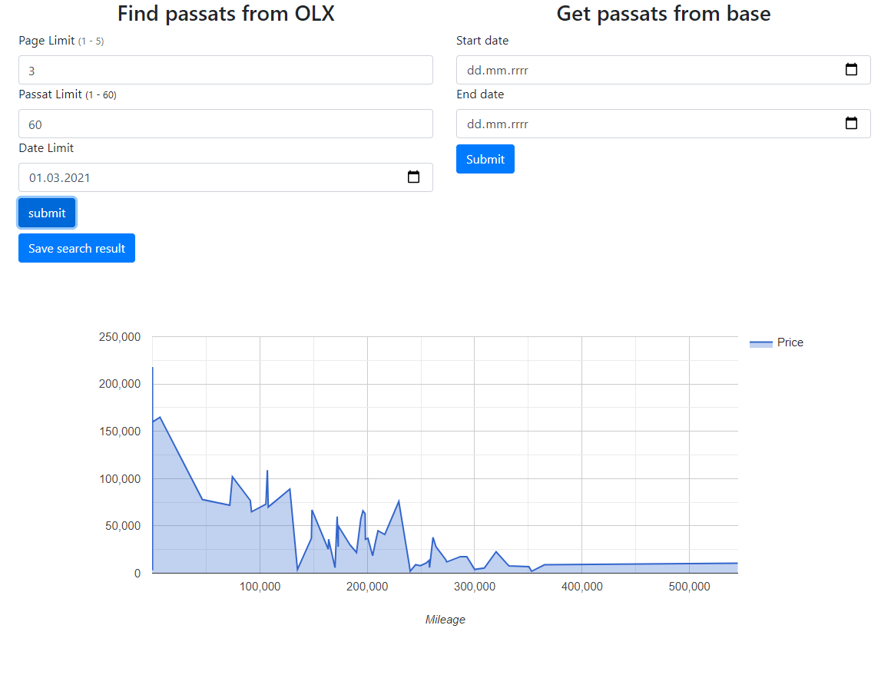

# Passat_scraper
> The application searches [OLX](https://www.olx.pl/motoryzacja/samochody/q-passat/) and extracts the name, price, mileage and publication date of passat offers. It displays the results on a graph and allows you to save them to the database.

## Table of contents
* [Screenshots](#screenshots)
* [Technologies](#technologies)
* [Setup](#setup)
* [Features](#features)

## Screenshots


## Technologies
* Spring-boot - 2.4.2
* Spring-data-jpa - 2.4.2
* Spring-validation - 2.4.2
* Thymeleaf - 3.0.12
* Hibernate - 5.4.27
* Bootstrap - 4.4.1
* JQuery - 3.5.1
* Maven
* MySQL
* Google Chart API
* Jsoup - 1.13.1

## Setup
To run this project you need a MySQL server running with the passat_scraper database. The script for generating the database can be found [here](https://github.com/GITjest/Passat_scraper/blob/master/passat_scrapper.sql).
```
# Clone this repository
git clone https://github.com/GITjest/Passat_scraper

# Go into the repository
cd Passat_scraper

# Run the app
mvn spring-boot:run
```
URL to access application UI: http://localhost:8080/

## Features
* Save result to database
* Displays the results on a graph
